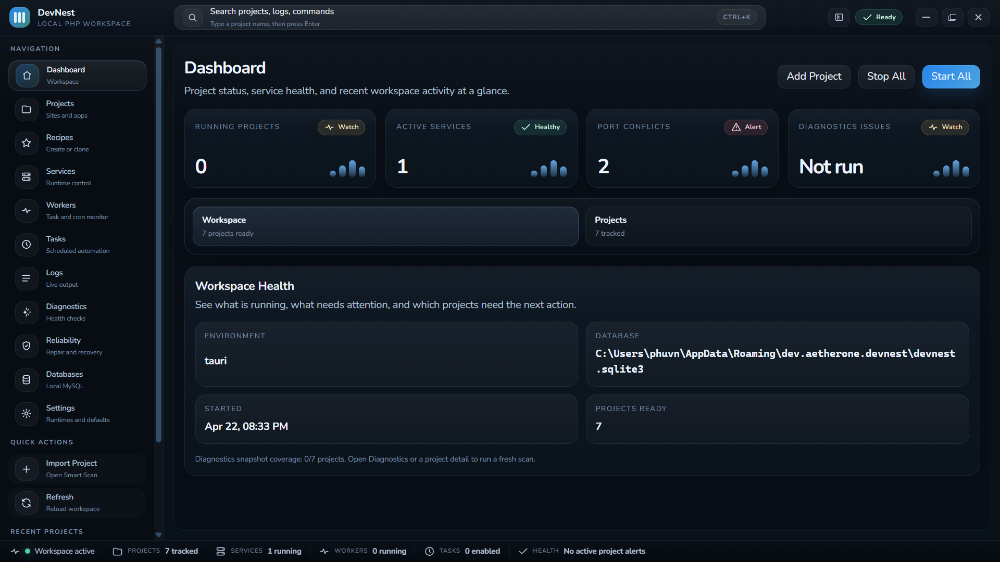
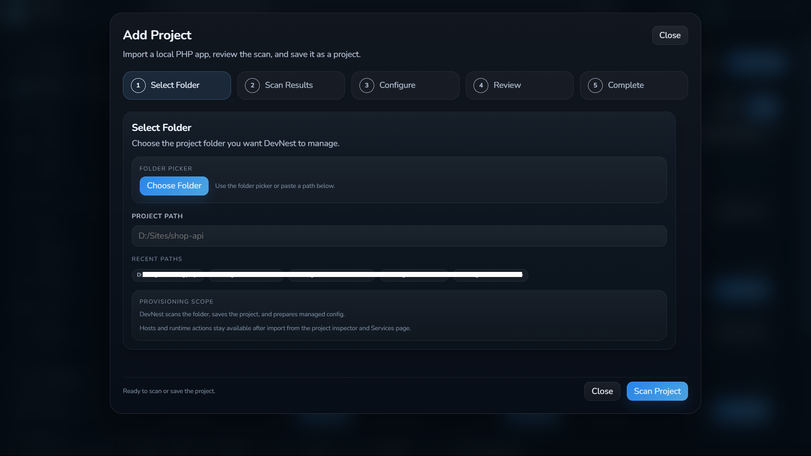
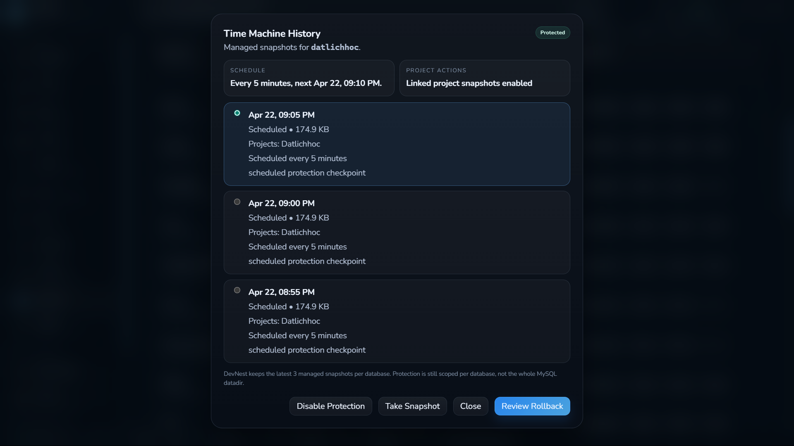
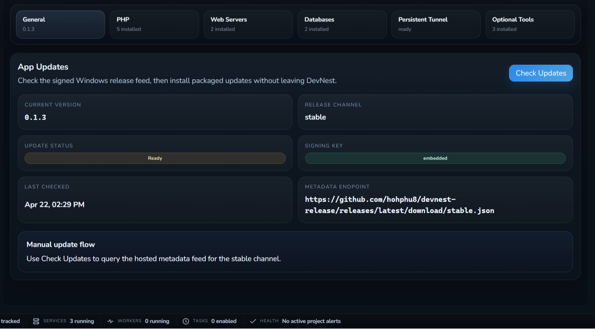
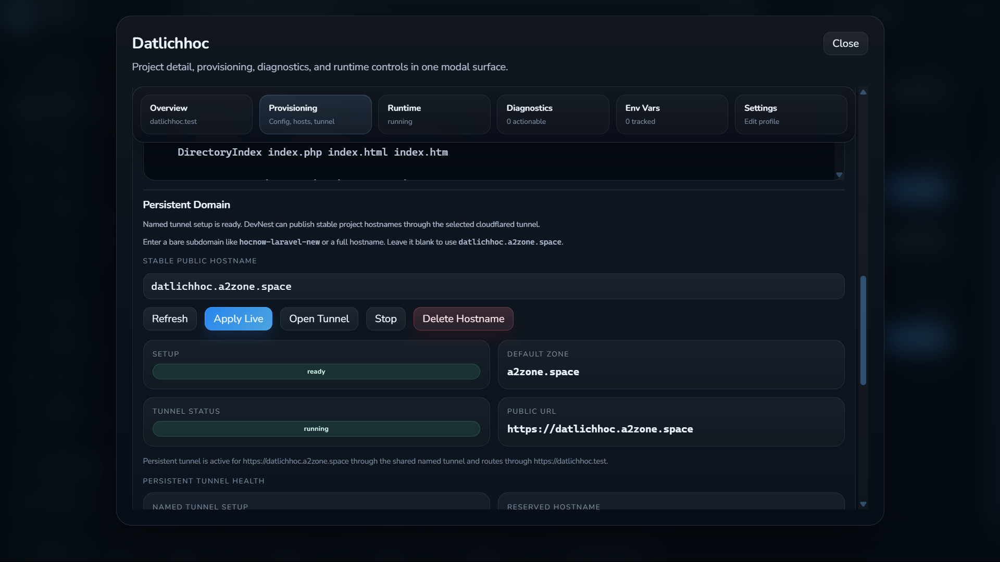
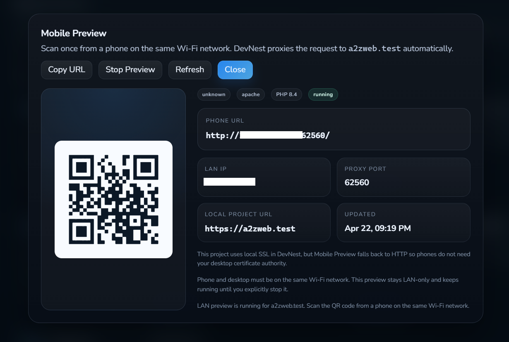
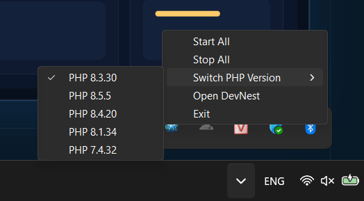

# DevNest

Smart local PHP workspace for Windows.

Open source under the MIT License.

DevNest is a project-first desktop app for Windows PHP developers. Import a project, let DevNest scan it, apply the local stack shape, then work with runtime control, readable diagnostics, sharing, recovery, and automation in one place.

Website: [devnest.one](https://devnest.one)

## What DevNest solves

Less setup drift. More project context. Fewer raw logs on the main path.

DevNest is built around the project first:

- What is this project?
- Which runtime should it use?
- Which local domain should it get?
- Why is it failing?
- What is the safest next fix?

## Core flow

1. Pick a project folder.
2. Let DevNest scan framework, domain, PHP, and document root.
3. Apply config, start services, and inspect diagnostics.

## Features

### Instant Smart Scan

Scan Laravel, WordPress, and plain PHP apps with domain suggestion, document-root inference, and runtime hints.

### Readable diagnostics

Turn local stack problems into practical next steps instead of forcing raw logs into the main workflow.

- Port conflicts
- Laravel `/public` mistakes
- SSL trust issues
- Missing PHP extensions
- MySQL startup failures

### Rich features out of the box

Managed config, hosts automation, SSL, phpMyAdmin, Mailpit, Redis, workers, scheduled tasks, and env visibility are already part of the shipped product.

- Apache and Nginx config generation
- PHP CLI follows the active runtime
- Project-owned workers and tasks
- Env diff against the real `.env` on disk

### Optimized recovery

Backup and restore matter, but Database Time Machine is what makes rollback fast, managed, and less stressful.

## Tooling

### Flexible project model

The project stays central. Local domain, runtime, diagnostics, sharing, and automation all hang off that model.

### Update delivery

Check the signed Windows release feed, then install packaged updates without leaving DevNest.

### First-class sharing

Same-WiFi QR preview is for quick phone checks. Cloudflare tunnel flows are there when you need a public URL.

### Continuous ecosystem integration

DevNest fits how Windows PHP developers actually work day to day.

- Switch between PHP versions and have CLI follow the active runtime
- Install PHP versions directly from the interface
- Manage PHP extensions and configuration visually
- Control Apache, Nginx, MySQL, and logs from one workspace

## More of the stack

DevNest also includes UI and workflows for:

- PHP tools and extensions
- PHP configuration
- Cloudflare tunnel connection and tunnel creation
- Apache and Nginx configuration
- Runtime control, PID tracking, port checks, and logs
- Per-project scheduled tasks
- Per-project workers and background commands

## Why it feels different

- Project-first: one model for local stack, preview, automation, and recovery
- Windows-native: built around the paths, permissions, and runtime habits that actually matter
- Human-readable: problems should lead to a likely fix, not just another log window

## Download

[Download on GitHub Releases](https://github.com/hohphu8/devnest/releases)

[View on GitHub](https://github.com/hohphu8/devnest)

> DevNest is an independently developed app. Since I have not purchased a code-signing certificate yet, Windows SmartScreen or your browser might flag the installer as an uncommon download.

- To install: click `Keep` -> `Show more` -> `Keep anyway`.
- Security: the core app executable has scanned clean on VirusTotal in manual checks. Installer files may still trigger a few heuristic detections while the project is new and unsigned.

## Webdocs

The public website and legal pages live in [`src-webdocs`](./src-webdocs).

Local commands:

- `npm --prefix src-webdocs install`
- `npm --prefix src-webdocs run dev`
- `npm --prefix src-webdocs run build`

## Contributing

DevNest accepts issues and pull requests.

- Start with [CONTRIBUTING.md](./CONTRIBUTING.md)
- Use [`.env.example`](./.env.example) as a reference for release-related environment variables
- Keep release secrets and updater keys out of git

## Security

Please read [SECURITY.md](./SECURITY.md) before reporting security-sensitive issues.

## Legal

- [Privacy Policy](https://devnest.one/privacy-policy.html)
- [Terms of Use](https://devnest.one/terms-of-use.html)
- [License](./LICENSE.md)

## License

DevNest is open source under the [MIT License](./LICENSE.md).

## Public positioning

- Platform: Windows
- Distribution: GitHub Releases
- Source model: open-source
- License: MIT
- Public website: `https://devnest.one`
